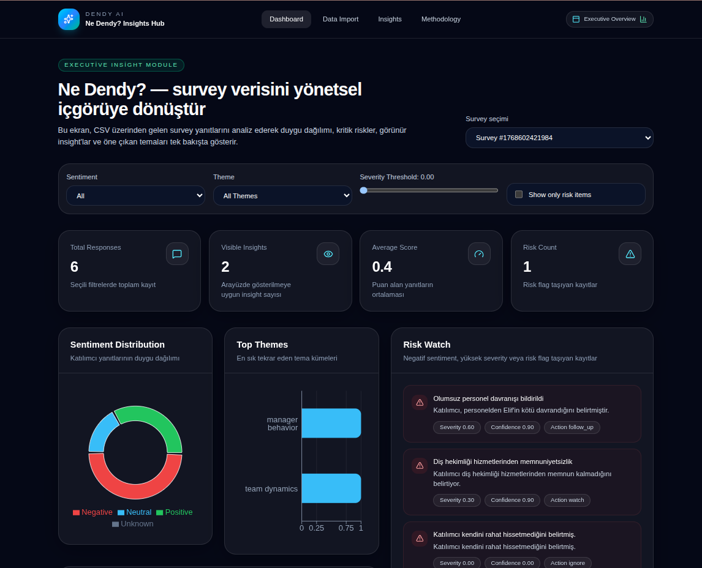
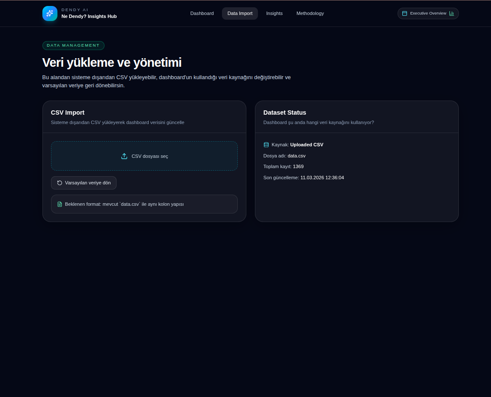
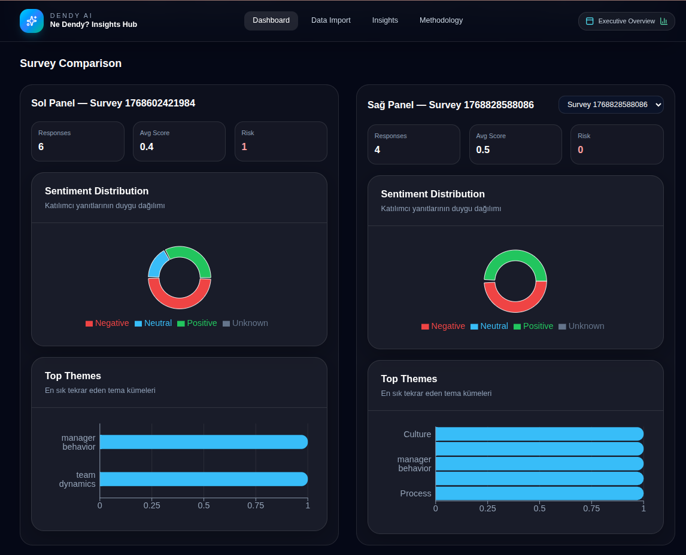

# Ne Dendy? Insights Dashboard

## Uygulama Görselleri

### Dashboard Overview


### Data Import


### Survey Comparison


Bu proje, Dendy.ai tarafından verilen **"Ne Dendy?" frontend case** görevi kapsamında geliştirilmiştir.

Amaç, anket (survey) verilerini içeren bir CSV dosyasını okuyarak bu verileri **yöneticilerin hızlıca anlayabileceği bir içgörü paneline (insight dashboard)** dönüştürmektir.

Dashboard, ham veriyi doğrudan göstermenin yerine aşağıdaki gibi anlamlı özetler üretir:

- KPI metrikleri
- Duygu (sentiment) dağılımı
- Tema (theme) analizi
- Risk içeren kayıtlar
- Öne çıkan içgörüler
- Yönetici özeti (AI-style summary)

Bu sayede yöneticiler yüzlerce satır veriyi incelemek yerine **durumu tek ekranda anlayabilir.**

---

# Projeyi Çalıştırma

Bu projede `node_modules` klasörü repo'ya eklenmemiştir.  
Projeyi çalıştırmadan önce bağımlılıkların kurulması gerekir.

### Projeyi Klonla

```bash
git clone <repo-url>
cd ne-dendy-case
```
### Node.js Kurulu Olduğundan Emin Ol

Node.js 18 veya üzeri önerilir.

Kontrol etmek için:

```
node -v

npm install

npm run dev
```

Tarayıcıda Aç : http://localhost:3000

# Veri Kaynağı

Varsayılan veri dosyası:
```public/data/data.csv```

Uygulama başlatıldığında bu CSV dosyası okunur ve analiz edilir.

Ek olarak kullanıcı Data Import sayfasından yeni bir CSV dosyası yükleyebilir.
Yüklenen veri localStorage içerisinde saklanır ve dashboard o veriyi kullanır.

# Projenin Özellikleri

Dashboard aşağıdaki özellikleri içerir:
- CSV dosyasını uygulama içinde okuyup parse etme
- survey_id bazlı filtreleme
- KPI metrikleri gösterimi
- Sentiment (duygu) dağılım grafiği
- Tema analizi grafiği
- Risk içeren kayıtları gösterme
- Öne çıkan içgörülerin listelenmesi
- Yönetici özeti (AI-style insight summary)
- CSV veri yükleme sistemi
- İki survey arasında karşılaştırma paneli
- Filtreleme sistemi

# Kullanılan Teknolojiler

## Next.js

Next.js framework'ü tercih edilmiştir çünkü:
- sayfa yapısını düzenli kurmayı sağlar
- React tabanlıdır
- component mimarisi için uygundur
- dashboard projeleri için hızlı geliştirme imkanı sunar

## TypeScript

TypeScript kullanılmasının nedeni:

CSV verisi ham formatta geldiği için veri dönüşümlerini güvenli hale getirmek.

TypeScript sayesinde:
- veri tipleri net tanımlanır
- hatalar erken yakalanır
- kod okunabilirliği artar

## Tailwind CSS

Arayüz geliştirme sürecini hızlandırmak ve tutarlı bir tasarım oluşturmak için Tailwind CSS kullanılmıştır.

Avantajları:
- hızlı UI geliştirme
- component bazlı stil
- temiz ve minimal dashboard görünümü

## Papa Parse

CSV dosyasını parse etmek için kullanılmıştır.

CSV dosyaları genellikle string formatında olduğu için Papa Parse:
- header bazlı parse
- güvenli veri okuma
- hızlı dönüşüm
sağlar.

## Recharts

Grafikler için kullanılmıştır.

Dashboard içinde kullanılan grafikler:
- sentiment dağılımı
- tema dağılımı
Bu grafikler yöneticinin veriyi hızlı anlamasını sağlar.

# Proje Yapısı
```
src/
├─ app/
│  ├─ page.tsx
│  ├─ data-import/page.tsx
│  ├─ insights/page.tsx
│  └─ methodology/page.tsx
│
├─ components/
│  ├─ layout/
│  ├─ dashboard/
│  └─ ui/
│
├─ lib/
│  ├─ csv.ts
│  ├─ transformers.ts
│  ├─ utils.ts
│  ├─ constants.ts
│  └─ storage.ts
│
└─ types/
   └─ survey.ts
```

# Sistem Nasıl Çalışır

Sistem aşağıdaki adımlarla çalışır:
1. CSV dosyası public/data/data.csv içinden okunur
2. Papa Parse ile CSV parse edilir
3. Ham veri normalize edilir
4. survey_id bazlı filtre uygulanır
5. Veriden türetilmiş metrikler hesaplanır

Bu metrikler:

KPI değerleri
- sentiment dağılımı
- tema frekansları
- risk kayıtları
- insight listesi
olur.

Bu veriler daha sonra dashboard bileşenlerine gönderilerek görselleştirilir.

# Dashboard Bölümleri

Dashboard aşağıdaki ana bileşenlerden oluşur:

## KPI Cards

Temel metrikler:
- Total Responses
- Visible Insights
- Average Score
- Risk Count

## Sentiment Distribution

Kullanıcı yorumlarının duygu dağılımını gösterir:
- Positive
- Neutral
- Negative
- Unknown

## Top Themes

En sık tekrar eden temaları gösterir.

Bu sayede yöneticiler kullanıcıların en çok hangi konulardan bahsettiğini görebilir.

## Risk Watch

Risk flag taşıyan kayıtları gösterir.

Bu panel yöneticinin kritik durumları hızlıca fark etmesini sağlar.

## Highlighted Insights

En önemli içgörülerin listelendiği paneldir.

Ham veriden çıkarılan anlamlı özetleri gösterir.

## AI Insight Summary

Filtrelenmiş veriye göre otomatik oluşturulan kısa yönetici özeti.

Gerçek bir LLM kullanılmadan rule-based mantıkla üretilmiştir.

## Survey Comparison

İki farklı survey'in yan yana karşılaştırılmasını sağlar.

Karşılaştırma alanında:
- sentiment dağılımı
- tema dağılımı
- temel KPI verileri
gösterilir.
